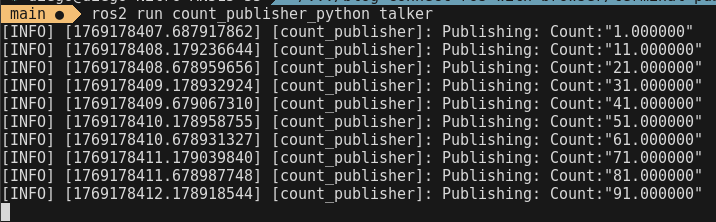
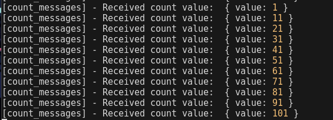
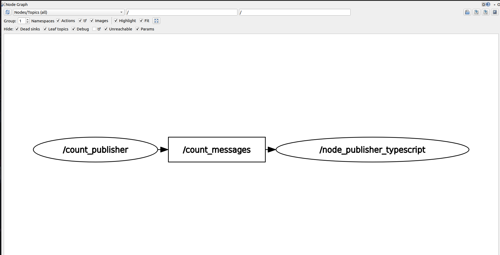
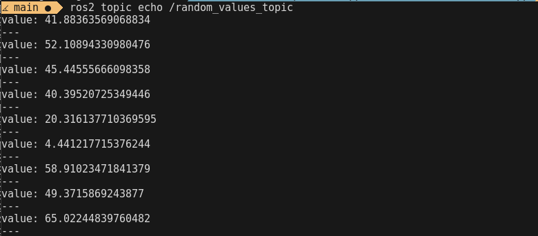
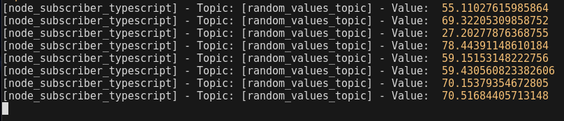
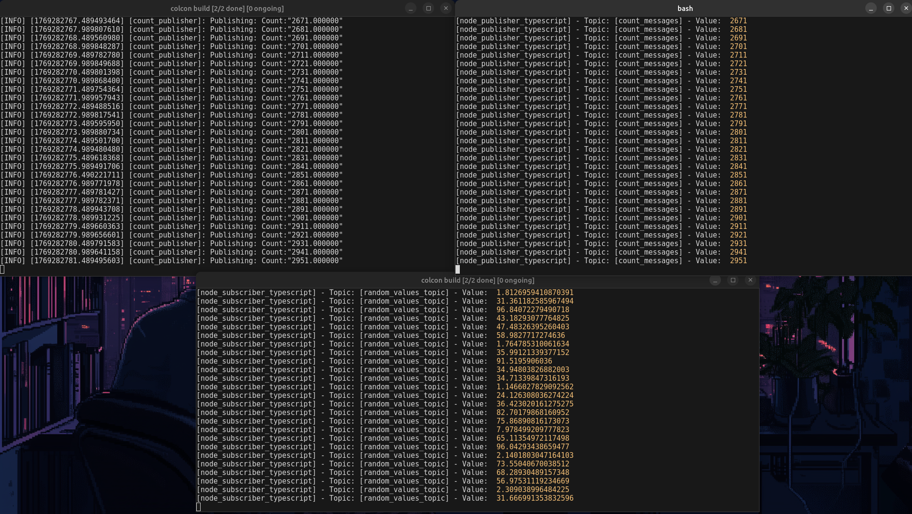
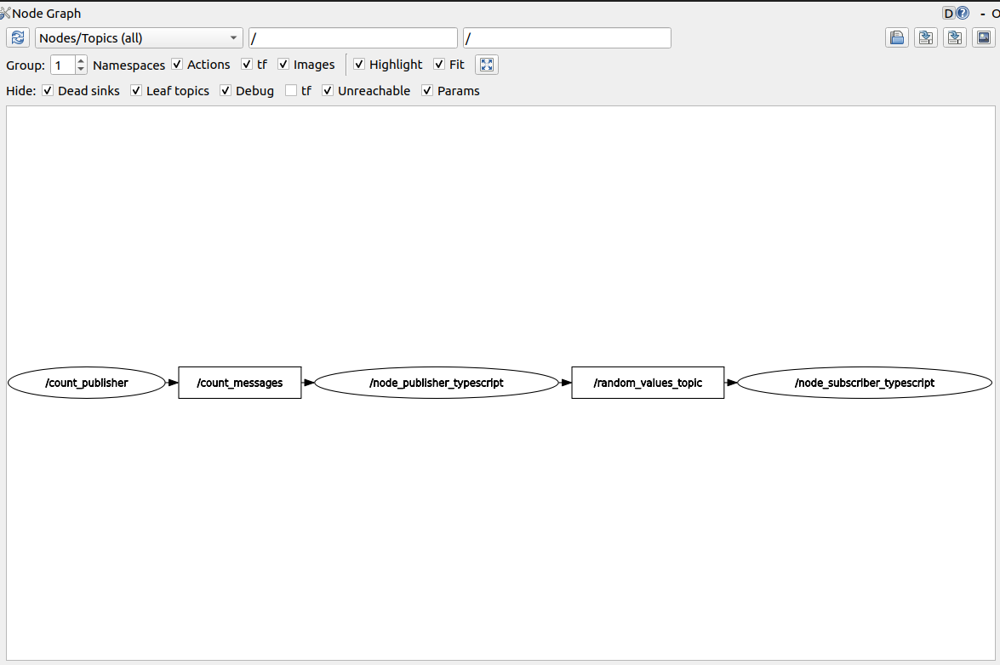

# How to publish and subscribe ROS 2 custom messages using Node.js

## Quem sou eu?

Hey! I'm Diego, I'm a researcher, work right now as a web developer and have a growing enthusiasm for robotics. Having recently graduated, my final project to get my degree were ROS related and for a while now I wanted to publish a tutorial like this, now I decided the the time has come.

## Introdução

Esse tutorial visa mostar como realizar a publicação ou subscrição de um tópico ROS2 (ROS) utilizando Node.js. Abordando conceitos básicos de ROS como, criar nós, criar um tópico, subscrever-se a um tópico e publicar em um tópico.

## Pré-requisitos

* **Node.js**: >= 16.20.2 — Utilizado por mim 22.18.0
* **ROS 2** (instalado e configurado ): Versões suportadas Rolling,
  Kilted,
  Jazzy,
  Humble - utilizei  instalado e compilado na minha máquina via código [fonte](https://docs.ros.org/en/humble/Installation/Alternatives/Ubuntu-Development-Setup.html)

  > Esse projeto pode ser realizado utilizando diferentes distros ROS, porém destaco que a versão que utilizei foi compilada da fonte.
* **Linux Distribution**: Nesse projeto foi utilizado o Ubuntu 22.04 LTS (embora possível a utilização de ROS 2 no windows, esse projeto foi desenvolvido pensando no ambiente linux).

## Setting up the environment

Para faciliar o desenvolvimento eu deixo disponível um repositório que contém um workspace ROS2 configurado com um publisher e uma mensagem customizada, ambos serão utilizados para o projeto. No repositório, você vai encontrar também a aplicação final desse projeto.

Todas a implementação do publisher e mensagem customizada foram feitas seguindo o tutorial oficial do ROS Humble, em caso de dúvidas, consulte o material [Writing a Simple Python Publisher and Subscriber](https://docs.ros.org/en/humble/Tutorials/Beginner-Client-Libraries/Writing-A-Simple-Py-Publisher-And-Subscriber.html).

> Para fins didáticos eu recomendo seguir as etapas do tutorial ao invés de se aventurar na implementação final em `/final-app/`.

Utilize o comando abaixo para clonar o repositório:

```bash
# HTTPS
git clone https://github.com/Daliego/pub-sub-ros-nodejs-application.git

# SSH
git clone git@github.com:Daliego/pub-sub-ros-nodejs-application.git
```

No repositório, você vai encontrar a seguinte estrutura de pastas:

```
pub-sub-ros-nodejs-application/
├── ros-ws-app/ # Ambiente ROS2 configurado
├── final-app/ # Aplicação Node.js com a implementação final desse tutorial
├── tutorial-implementation/ # Pasta onde você vai implementar o tutorial descrito aqui
├── setup_ros.sh/ # Script para configurar o ambiente ROS2
└── README.md
```

> A pasta `tutorial-implementation` foi deixada no repositório pra que possa ser utilizada para a implementação do tutorial descrito aqui. E a pasta `final-terminal-app` é a aplicação final que esse tutorial está descrevendo.

O script `setup_ros.sh` foi deixado aqui para facilitar o carregamento das variáveis de ambiente do ROS e carregar o workspace local (custom\_interface e count\_publisher\_python). Para utilizar o script basta executar o comando `source setup_ros.sh`. No script, a linha 12 (`source ~/ros2_humble/install/setup.bash`) deve ser alterada para o path do seu ROS2 installation.

### Executando o publisher python

A primeira etapa do tutorial visa mostar como escutar mensagens do ROS em terminal Node.js.

Desse modo, antes de qualquer configuração do ambiente Node.js, vamos realizar a execução do publisher python utilizando ROS 2.

Acesse o workspace `/ros-ws-app`, compile e execute o projeto com os comandos abaixo:

```bash
# Carregue as variáveis de ambiente
source setup_ros.sh
# Em caso de ainda não ter realizado a substituição do path para a sua instalação do ROS2, você pode executar o comando: 
# `source $ROS2_PATH/install/setup.bash`

# Tenha certeza de estar na raiz do repositório clonado e navegue até a pasta `ros-ws-app`
cd ros-ws-app

# Compile o workspace
colcon build


# Tendo o projeto compilado, carregue as variáveis novamente com o setup_ros.sh e execute o publisher python
source ../setup_ros.sh
# Execute o publisher python
ros2 run count_publisher_python talker
```

Você deve ver o seguinte output no terminal:



A imagem acima mostra o output do o publisher python  está publicando no tópico `count_messages`. Ele esta enviado mensagen no formato de um objeto

O que o publisher python faz é criar um nó ROS chamado de `count_publisher`, esse nó (bloco de código ROS configurado para realizar uma ação específica) publicará mensagens no tópico chamado de `count_messages` com a mensagem customizada `Count`. Todo o código resposável por isso pode ser encontrado no arquivo [`publisher_member_function.py`](https://github.com/Daliego/pub-sub-ros-nodejs-application/blob/main/ros-ws-app/src/count_publisher_python/count_publisher_python/publisher_member_function.py) do repositório.

O formato de mensagem customizada `Count` é definido no arquivo [Count.msg](https://github.com/Daliego/pub-sub-ros-nodejs-application/blob/main/ros-ws-app/src/custom_interface/msg/Count.msg), ele é composto por um único campo `value` do tipo `float64`.

Exemplo de mensagem publicada:

```json
{
// OBS: Os valores são float 64
"value": 11.0000000
}
```

### Escutando mensagens do ROS com Node.js

Agora, com o objetivo de escutar as mensagens do tópico `count_messages`, precisaremos criar um novo nó ROS, esse vai ser reponsável por sobscrever-se  no tópico. Nesse sentido, ao invés de criarmos um [subscriber python ou C/C++ executado com ROS2](https://docs.ros.org/en/humble/Tutorials/Beginner-Client-Libraries/Writing-A-Simple-Py-Publisher-And-Subscriber.html), vamos utilizar o Node.js com a biblioteca [rclnodejs](https://github.com/RobotWebTools/rclnodejs).

#### Instalando as dependências do Node.js

Antes de começarmos a implementar, precisamos configurar o ambiente Node.js com as dependências necessárias. Acesse a pasta `tutorial-implementation` e inicialize o projeto:

```bash
# Acesse a pasta tutorial-implementation
cd tutorial-implementation

# Inicialize o projeto Node.js
npm init -y

# Instale o rclnodejs e as dependências de desenvolvimento
npm install rclnodejs
npm install --save-dev typescript @types/node ts-node
```

#### Configurando o ambiente TypeScript

O projeto inteiro foi desenvolvido utilizando TypeScript, simplesmente para facilitar a leitura e manutenção do código. E porque eu gosto muito de ter a garantia de tipagem do TypeScript.

Crie um arquivo `tsconfig.json` na pasta `tutorial-implementation` com a seguinte configuração:

```json
// nano tsconfig.json
{
  "compilerOptions": {
    "target": "ES2020",
    "module": "commonjs",
    "lib": ["ES2020"],
    "outDir": "./dist",
    "rootDir": "./",
    "strict": true,
    "esModuleInterop": true,
    "skipLibCheck": true,
    "forceConsistentCasingInFileNames": true,
    "resolveJsonModule": true
  },
  "include": ["**/*.ts"],
  "exclude": ["node_modules"]
}
```

> **Nota importante**: O `rclnodejs` requer que o ambiente ROS2 esteja configurado antes de ser executado. Certifique-se de ter executado o `source setup_ros.sh` ou o source do seu ROS2 antes de executar qualquer código Node.js que utilize o `rclnodejs`.

#### Criando o arquivo publisher.ts

Agora vamos criar o arquivo `publisher.ts` onde implementaremos o primeiro nó ROS:

```bash
# Ainda dentro da pasta tutorial-implementation
touch publisher.ts
```

No arquivo `publisher.ts`, vamos começar com a estrutura básica de um nó ROS, que é a inicialização da classe ROS e a criação do nó:

```typescript
import ROS, { type MessagesMap, type TypeClass } from "rclnodejs";

ROS.init().then(() => {
  const node = new ROS.Node("node_publisher_typescript");

// O tipo nao existe em runtime, por isso o as unknown as TypeClass<keyof MessagesMap>
  const countTypeMessage = "custom_interface/msg/Count" as unknown as TypeClass<
    keyof MessagesMap
  >;

  node.spin();
});
```

Este código inicial:

* Importa o módulo `rclnodejs` e os tipos necessários
* Inicializa o ROS com `ROS.init()`
* Cria um novo nó ROS chamado `node_publisher_typescript`
* Define o tipo de mensagem que será utilizado (`custom_interface/msg/Count`)
* Mantém o nó ativo e processando mensagens com o `node.spin()`

#### Etapa 1 - Criando um subscriber para receber as mensagens do tópico `count_messages`

Agora pode ser implementada a primeira funcionalidade do sistema, que é utilizar o nó criado para se subscrever ao tópico `count_messages` que está sendo publicado pelo publisher Python.

Atualize o arquivo `publisher.ts` com o seguinte código:

```typescript
import ROS, { type MessagesMap, type TypeClass } from "rclnodejs";

ROS.init().then(() => {
  const node = new ROS.Node("node_publisher_typescript");
  const countTypeMessage = "custom_interface/msg/Count" as unknown as TypeClass<
    keyof MessagesMap
  >;

  // Etapa 1 - Criar um subscriber para receber os mensagens do tópico `count_messages`
  node.createSubscription(countTypeMessage, "count_messages", (message) => {
    console.log("[count_messages] - Received count value: ", message);
  });

  node.spin();
});
```

O método `createSubscription` recebe três parâmetros:

* **Tipo da mensagem**: `countTypeMessage` - define o formato da mensagem que será recebida
* **Nome do tópico**: `"count_messages"` - o tópico ao qual queremos nos subscrever
* **Callback**: função que será executada sempre que uma nova mensagem for recebida no tópico

Execute o código, utilizando os comandos abaixo:

```bash
# Certifique-se de estar na pasta tutorial-implementation
# E que o ambiente ROS2 está configurado
source ../setup_ros.sh

# Execute o código
npx ts-node publisher.ts
```

Você deve começar a receber no terminal as mensagens publicadas no tópico:



Ainda, ao executar o `rqt_graph` é possível ver de maneira visual os nós e tópicos ativos no ROS 2.

```bash
# Em outro terminal, com o ambiente ROS2 configurado
# Nao esqueça de realizar o source do setup_ros.sh
ros2 run rqt_graph rqt_graph
```

O output da execução do `rqt_graph` é o seguinte:



A visualização acima mostra que existem dois nós ativos:

* `count_publisher`: o nó Python que está publicando no tópico `count_messages`
* `node_publisher_typescript`: o nó Node.js que está subscrevendo-se ao tópico `count_messages`

O tópico `count_messages` é utilizado para realizar a comunicação entre os dois nós, mostrando que ambos estão publicando mensagens e recebendo mensagens.

#### Etapa 2 - Criando um publisher para publicar em um novo tópico

Agora duas coisas serão realizadas, a criação de um novo tópico e a publicação de mensagens dentro dele.

```typescript
import ROS, { type MessagesMap, type TypeClass } from "rclnodejs";

interface Count {
  value: number;
}

ROS.init().then(() => {
  const node = new ROS.Node("node_publisher_typescript");
  const countTypeMessage = "custom_interface/msg/Count" as unknown as TypeClass<
    keyof MessagesMap
  >;

  // Etapa 1 - Criar um subscriber para receber os mensagens do tópico `count_messages`
  node.createSubscription(countTypeMessage, "count_messages", (message) => {
    console.log("[count_messages] - Received count value: ", message);
  });

  // Etapa 2 - Criar um novo tópico que vai receber mensagens de node_publisher_typescript
  const publisher = node.createPublisher(
    countTypeMessage,
    "random_values_topic"
  );

  // Configuração para publicar a cada 10 segundos
  const timer = node.createTimer(BigInt(10000000000), () => {
      publisher.publish({ value: Math.random() * 100 });
    });

  node.spin();
});
```

O método `createPublisher` vai ser utilizado para criar um novo tópico, esse tópico vai receber o mesmo tipo de mensagem do tópico `count_messages`.

A variável `publisher` é um instância do objeto `Publisher` do rclnodejs, ela contém diversos métodos para manipular esse novo tópico, como publicar mensagens, acessar o nome do tópico, verificar se o tópico ainda está ativo, etc.

Para que as mensagens aleatórias que estão sendo geradas se mantenham sendo publicadas no tópico `random_values_topic`, algum tipo de loop precisa ser utilizado.

O método `createTimer` do rclnodejs é uma opção para manter a publicação por intervalo de tempo, inclusive é uma alternativa ao setTimeout nativo do javascript.

Para verificar o funcionamento do timer, podemos executar o comando abaixo no terminal:

```bash
# Em outro terminal, com o ambiente ROS2 configurado
ros2 topic echo /random_values_topic
```

Um output como o abaixo poderá ser visto:



#### Etapa 3 - Criando um subscriber para o novo tópico

O objetivo dessa etapa é criar um segundo nó, que se sobscreva no novo tópico `random_values_topic` e log as mensagens recebidas. Para fins de organização, eu vou criar um novo arquivo para esse novo nó. Com isso, é possível executar o novo nó em um terminal separado.

```bash
# Dentro da pasta tutorial-implementation
touch subscriber.ts
```

No arquivo `subscriber.ts`, adicione:

```typescript
import ROS, { type MessagesMap, type TypeClass } from "rclnodejs";

interface Count {
  value: number;
}

ROS.init().then(() => {
  const nodeSubsriber = new ROS.Node("node_subscriber_typescript");
  const countTypeMessage = "custom_interface/msg/Count" as unknown as TypeClass<
    keyof MessagesMap
  >;

  // Etapa 3 - Criar um subscriber para receber os mensagens do novo tópico
  nodeSubsriber.createSubscription(
    countTypeMessage,
    "random_values_topic",
    (message) => {
      const messageFormated = message as unknown as Count;
      console.log(
        "[node_subscriber_typescript] - From:[random_values_topic] - Value: ",
        messageFormated.value
      );
    }
  );

  nodeSubsriber.spin();
});
```

Para executar o código, utilize os comandos abaixo:

```bash
# Terminal 1 - com o ambiente ROS2 configurado
source ../setup_ros.sh
npx ts-node publisher.ts

# Terminal 2 - com o ambiente ROS2 configurado
source ../setup_ros.sh
npx ts-node subscriber.ts
```

Você verá no terminal do `subscriber.ts` as mensagens sendo recebidas do tópico `random_values_topic`:



Se você estiver como os três terminais abertos, você verá o seguinte output:



Visualize novamente com o `rqt_graph` para observar a organização dos nós e tópicos:

```bash
ros2 run rqt_graph rqt_graph
```



## Conclusão

Neste tutorial, você aprendeu como utilizar Node.js para se comunicar com a infraestrutura ROS 2, criando publishers e subscribers que podem trocar mensagens customizadas através de tópicos.

Os conceitos abordados aqui como criar nós, subscrever-se a tópicos e publicar mensagens são fundamentais para qualquer aplicação ROS 2. Com o `rclnodejs`, você pode facilmente integrar aplicações Node.js com sistemas robóticos baseados em ROS 2, ou utilizar o Node.js simplesmente para manipular alguma parte específica do sistema robótico.

## Future projects

Eu espero trazer no futuro alguma outra aplicação utilizando a mesma abordagem de comunicação pub-sub, utilizando talvez outra biblioteca ou trazendo uma implementação mais complexa.

## Recursos

* [ROS 2 Installation Guide (Ubuntu Development Setup)](https://docs.ros.org/en/humble/Installation/Alternatives/Ubuntu-Development-Setup.html)
* [Writing a Simple Python Publisher and Subscriber](https://docs.ros.org/en/humble/Tutorials/Beginner-Client-Libraries/Writing-A-Simple-Py-Publisher-And-Subscriber.html)
* [rclnodejs - ROS 2 Client Library for Node.js](https://github.com/RobotWebTools/rclnodejs)
* [Repositório do Projeto](https://github.com/Daliego/pub-sub-ros-nodejs-application)
* [ROS 2 Standard Interfaces (Messages)](https://docs.ros.org/en/humble/Concepts/About-ROS-Interfaces.html)

---

> Se este tutorial foi útil para você, considere dar uma estrela no repositório e seguir para mais conteúdo sobre ROS 2 e Node.js!
