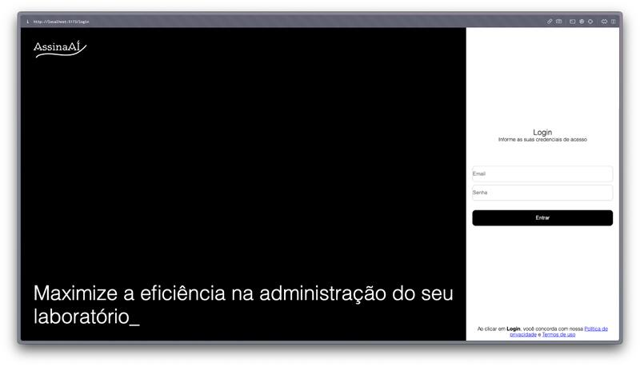
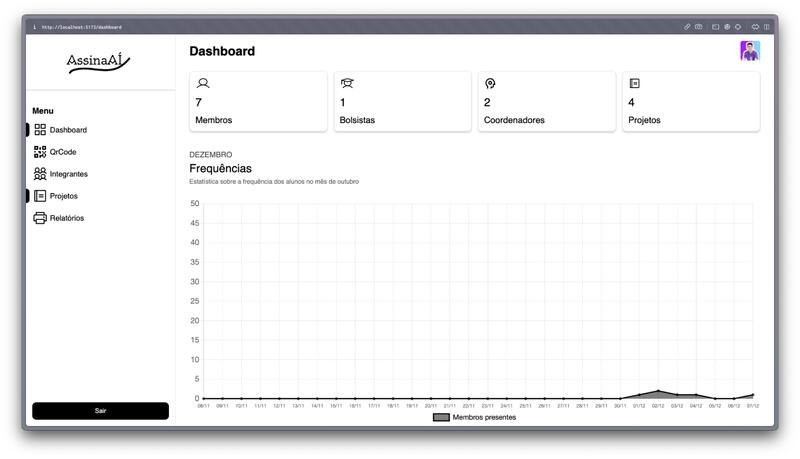
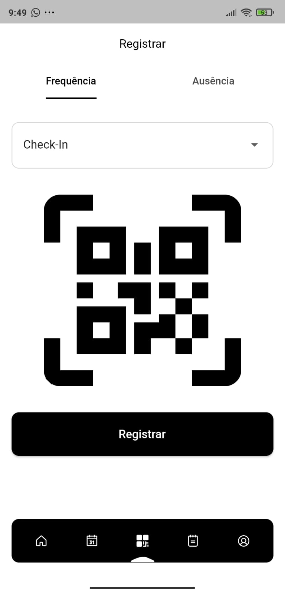
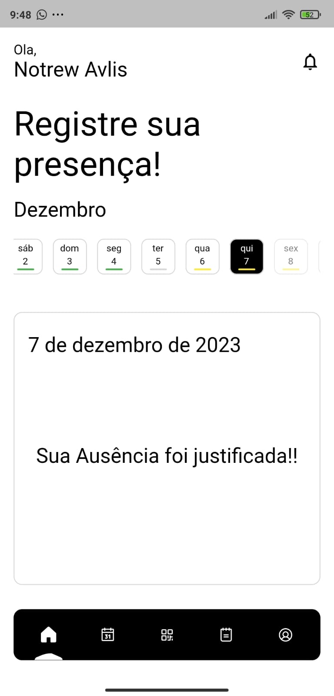
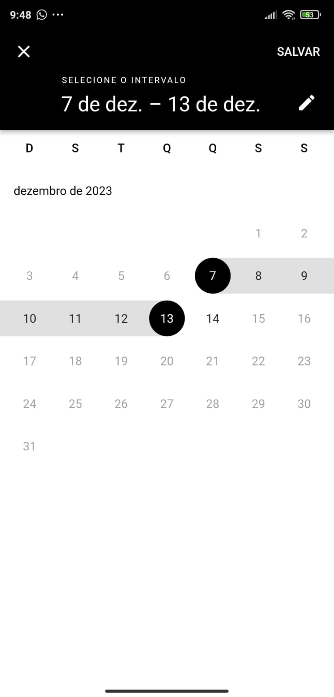
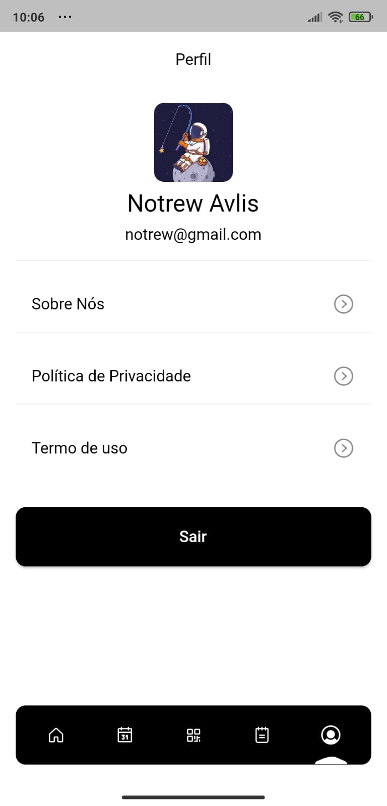

##### Project Overview

**AssinaAí (Checkin Now!)** - June 2023 to November 2023

At IFPI, Teresina Central campus, it is essential to control student attendance in the laboratories to ensure safety and to meet the weekly workload required in projects, as well as to guarantee the minimum hours for scholarship students.

The application was made with two modules. The first was a web panel built with React as the main development tool, and the second was a mobile application.

##### Project Images

###### Web Panel - Login Page

###### Web Panel - Attendance Dashboard

###### Mobile App - Check-in Screen

###### Mobile App - Reading QR Code

###### Mobile App - Presence/Attendance

###### Mobile App - Interval Attendance Filter

###### Mobile App - Profile Page

##### Architecture & Components

**Web Panel:**
In the web panel, services were used to handle the communication between the panel and Firebase, and reducers were used to keep the received data in states. These reducers with contexts can be used throughout the entire application, a React feature that makes sharing state between components easier. The pages are built with smaller and simpler components, which helps with code reuse and maintenance.

**Mobile Application:**
In the mobile application, we used the Flutter framework with the Dart language because of its efficiency for cross platform development and its performance that matches native applications. The Clean Architecture pattern was implemented following the principles of Reso Coder in three layers:

- **Domain Layer**: The core of the application with business rules and logic that should not depend on external frameworks
- **Data Layer**: Takes care of data persistence and external operations, keeping responsibilities separate
- **Presentation Layer**: Holds the user interface and direct interaction with the user

For state management and dependency injection, we used a modular pattern and applied factories for efficient modularization and dependency handling. Provider was used to manage the application state, ensuring proper dependency management across the system.

##### Technology Stack

**Web Panel:**
- React.js
- Firebase integration via services
- Reducers + Context API for state management
- Component-based architecture

**Mobile Application:**
- Flutter framework
- Dart programming language
- Clean Architecture (Reso Coder pattern)
- Provider for state management
- Modular pattern with factories for dependency injection

**Backend & Services:**
- Firebase (authentication, database, cloud functions)
- Real-time data synchronization

##### Key Features

- **Attendance Control**: Track student presence in laboratories
- **Real-time Monitoring**: Live updates of who is in the lab
- **Workload Tracking**: Monitor weekly project hours
- **Scholarship Management**: Ensure minimum hours for scholarship students
- **Safety Compliance**: Monitor laboratory access for security
- **Cross-platform**: Web panel for administrators and mobile app for students
- **Firebase Integration**: Cloud-based data storage and synchronization

##### Key Features

- **Attendance Control**: Track student presence in laboratories
- **Real-time Monitoring**: Live updates of who is in the lab
- **Workload Tracking**: Monitor weekly project hours
- **Scholarship Management**: Ensure minimum hours for scholarship students
- **Safety Compliance**: Monitor laboratory access for security
- **Cross-platform**: Web panel for administrators and mobile app for students
- **Firebase Integration**: Cloud-based data storage and synchronization

##### Project Context

This project was developed at IFPI - Teresina Central campus to address the essential need for controlling student attendance in laboratories. The system ensures:

1. **Safety**: Know who is present in laboratory facilities at any given time
2. **Academic Compliance**: Track and verify that students meet their required weekly project hours
3. **Scholarship Requirements**: Monitor and guarantee that scholarship students fulfill their minimum hour requirements

##### Skills & Competencies

- Reactive Programming
- React.js

##### Project Association

**Associated with**: IFPI - Instituto Federal do Piauí

**Project Period**: June 2023 - November 2023

**Note**: The source code for this project is not publicly available. This project was developed as part of academic work at IFPI - Teresina Central.

**Related Project**: I later applied animation techniques learned from my [Typing / Letter-Scramble Animation](/personal-work/typing-letter-scramble-animation/) project to enhance this application.

