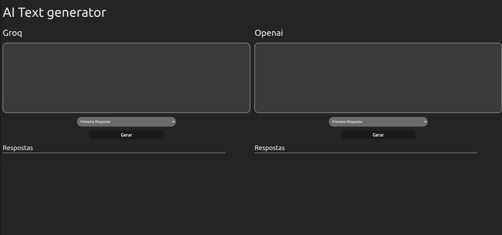

##### Project Overview

A small React application designed to test and compare AI-generated text responses from both Groq and OpenAI APIs. This tool connects to a Django backend that interfaces with both AI services, allowing you to easily compare the quality and characteristics of responses from each provider side-by-side.

##### Project Images

##### Repository

- **Repository:** [GitHub](https://github.com/Daliego/gpt-syslae-ui)
