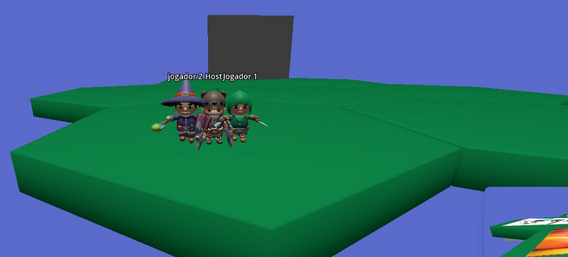
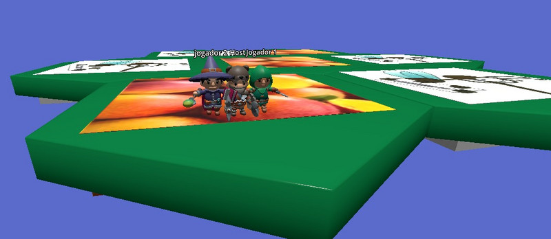
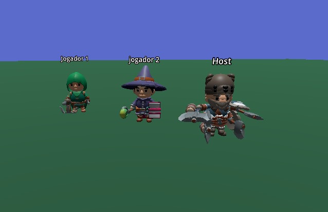
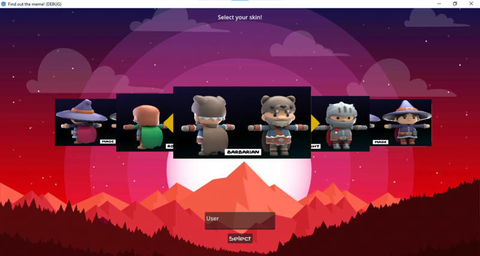

## Find out the meme

The Project is a 3D “Party Game” game developed in Godot Engine 4, which has mechanics similar to a phase in the game Fall Guys, in which the characters are positioned above platforms, with respective images, and after a certain time, an image is presented on a screen and players have a short period of time to move to a platform that has the same image.

### Overview

In the case of “Find out the meme”, the platforms will contain images related to memes and the panel will display a reference to one of the memes presented, meaning that players will have to take the meme reference and position themselves.

### Gameplay

- 3D Party Game mechanics
- Players must identify meme references
- Move to the correct platform within a time limit
- **Controls:** Use the arrow keys on the keyboard
- **Start Game:** Host user must click the "home" key to start the game room after all players access the lobby

### Platforms

- MS Windows

### Tools and Technologies

- Godot Engine 4

### Download

**Executables zip:** [https://ggjv4.s3.us-west-1.amazonaws.com/files/games/2024/299576/exec/Find%20out%20the%20meme!\_0.zip?VersionId=UPV70PIAOZgWAQYOWLFFbPte_r9Cy3aU](https://ggjv4.s3.us-west-1.amazonaws.com/files/games/2024/299576/exec/Find%20out%20the%20meme!_0.zip?VersionId=UPV70PIAOZgWAQYOWLFFbPte_r9Cy3aU)

**Source Code:** [https://ggjv4.s3.us-west-1.amazonaws.com/files/games/2024/299576/src/Find_out_the_meme!.zip?VersionId=XS310EvVT1bYJGZ8hOETVcx4GGBQs_am](https://ggjv4.s3.us-west-1.amazonaws.com/files/games/2024/299576/src/Find_out_the_meme!.zip?VersionId=XS310EvVT1bYJGZ8hOETVcx4GGBQs_am)

### Installation

Unzip the zipped executable file in the desired folder and run the .exe file, remembering that the .pck file cannot be deleted or moved to a different directory than the .exe file.

### Game Stills

**Gameplay Level**

**Gameplay Level View 2**

**Lobby**

**Character Skins**

### Credits

#### Game Authors

- **Daliego** : 

    (GitHub: [https://github.com/Daliego](https://github.com/Daliego))

    (LinkedIn: [https://www.linkedin.com/in/daliego/](https://www.linkedin.com/in/daliego/))

- **Paulo R. A. Leal** :

    (LinkedIn: [https://www.linkedin.com/in/paulo-ra-leal/](https://www.linkedin.com/in/paulo-ra-leal/))

### Jam Info

- **Jam Site:** Global Game Jam 2024
- **Jam Year:** 2024
- **Diversifier:** Sharing is caring - (Sponsored by Github)
- **Link:** [https://globalgamejam.org/games/2024/find-out-meme-8](https://globalgamejam.org/games/2024/find-out-meme-8)

### Links

- **Repository:** [https://github.com/Daliego/find-out-the-meme](https://github.com/Daliego/find-out-the-meme)
- **Game Executable:** [Link](https://ggjv4.s3.us-west-1.amazonaws.com/files/games/2024/299576/exec/Find%20out%20the%20meme!_0.zip?VersionId=UPV70PIAOZgWAQYOWLFFbPte_r9Cy3aU)
- **Game Files (Source):** [Link](https://ggjv4.s3.us-west-1.amazonaws.com/files/games/2024/299576/src/Find_out_the_meme!.zip?VersionId=XS310EvVT1bYJGZ8hOETVcx4GGBQs_am)
