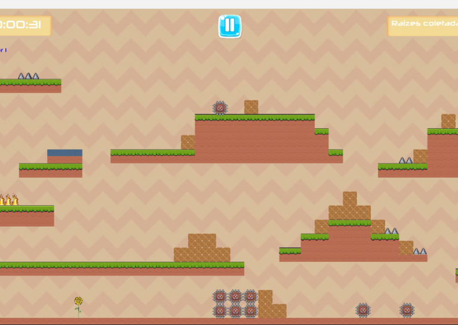
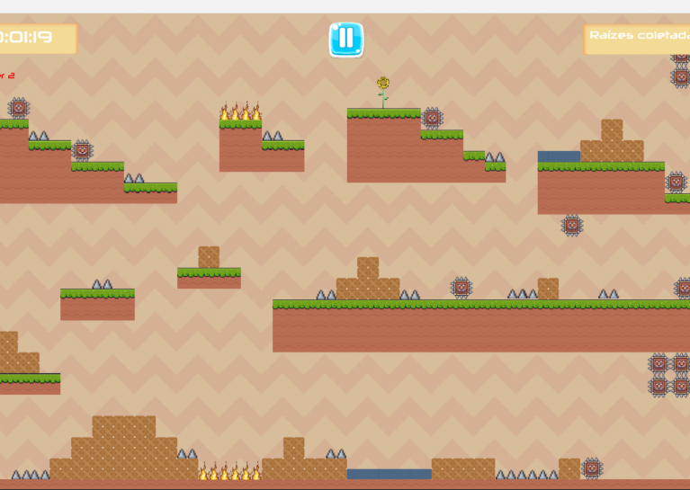
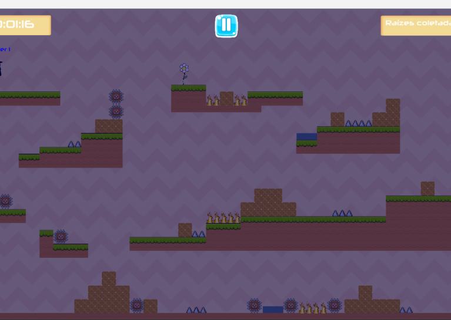

## The Magic Roots

A 2D local multiplayer platformer built with Godot Engine 3, created during a game jam. Two players must cooperate to solve puzzles, avoid traps, and collect magical roots before time runs out. Each level can be completed by reaching the final portal, but collecting roots increases the score and rewards up to three stars.

### Overview

In each stage, players work together to overcome obstacles and complete objectives under a time limit. The game encourages coordination, since both characters share the same environment and must combine movement and timing to progress.

### Gameplay

- Local co-op for two players on the same machine
- Puzzle driven levels with traps and obstacles
- Time limited stages
- Optional collectible system that affects scoring
- Collect all roots to earn three stars
- Finish by reaching the portal without collecting roots to unlock the next level, but earn no stars for that stage

### Controls

- **Player 1:** A, W, D
- **Player 2:** Left Arrow, Up Arrow, Right Arrow

### Platforms

- Windows
- Linux

### Tools and Technologies

- Godot Engine 3

### Download

**Executables zip:** [https://ggj.s3.amazonaws.com/games/2023/02/741508/exec/12j6Q/Executaveis.zip](https://ggj.s3.amazonaws.com/games/2023/02/741508/exec/12j6Q/Executaveis.zip)

### Installation

#### Windows

1. Extract the zip file to any folder.
2. Open the extracted folder and run the executable.
3. **Important:** Do not delete the `arquivos` folder inside the extracted directory. It stores the game progress file.

#### Linux

1. Extract the zip file to any folder.
2. Open the extracted folder and run the executable.
3. **Important:** Do not delete the `arquivos` folder inside the extracted directory. It stores the game progress file.

### Game Stills

**First Phase**

**First Part of Third Phase**

**Second Part of Third Phase**

### Credits

#### Game Authors

- **Paulo R. A. Leal**  
  LinkedIn: [https://www.linkedin.com/in/paulo-ra-leal/](https://www.linkedin.com/in/paulo-ra-leal/)

- **Diego S. Araujo**  
  LinkedIn: [https://www.linkedin.com/in/daliego/](https://www.linkedin.com/in/daliego/)

- **Igor Gabriel**  
  LinkedIn: [https://www.linkedin.com/in/igorgabriel14/](https://www.linkedin.com/in/igorgabriel14/)

#### Acknowledgements

Special thanks to LABIRAS, the robotics lab at the Federal Institute of Education, Science and Technology of Piauí, especially (Professor Francisco Marcelino)[https://integra.ifpi.edu.br/portfolio/pessoas/francisco-marcelino-almeida-de-araujo], and (Kauê Cavalcante)[https://www.linkedin.com/in/kaue-cavalcante/?originalSubdomain=en] for their support.

### Jam Info

- **Jam Site:** PONG, Potiguar Indie Games
- **Jam Year:** 2023
- **Diversifier:** Couch Potato
- **Tags:** 2D, Platformer, Puzzle, Strategy, Team

### Documentation

- **Application GDD:** [Link](https://www.linkedin.com/in/daliego/details/projects/660111982/multiple-media-viewer/?profileId=ACoAADdAuzoBSdg4kx73PL4z5Ku8KYq0Vv8syEc&treasuryMediaId=1764331626235)

### Links

- **Game Jam page:** [https://ggj.s3.amazonaws.com/games/2023/02/741508/exec/12j6Q/Executaveis.zip](https://ggj.s3.amazonaws.com/games/2023/02/741508/exec/12j6Q/Executaveis.zip)
- **Repository:** [https://bitbucket.org/labiras/themagicroots/src/main/](https://bitbucket.org/labiras/themagicroots/src/main/)
