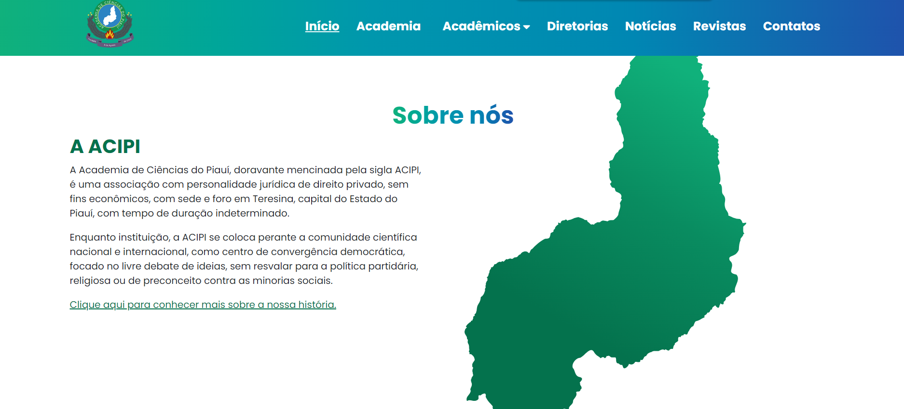
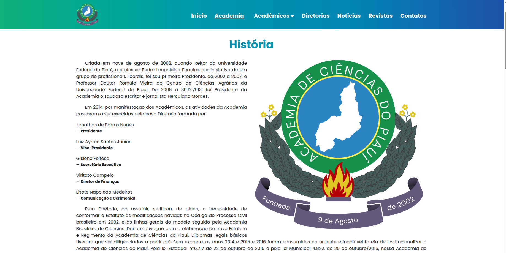
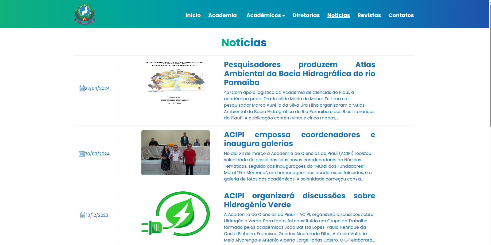
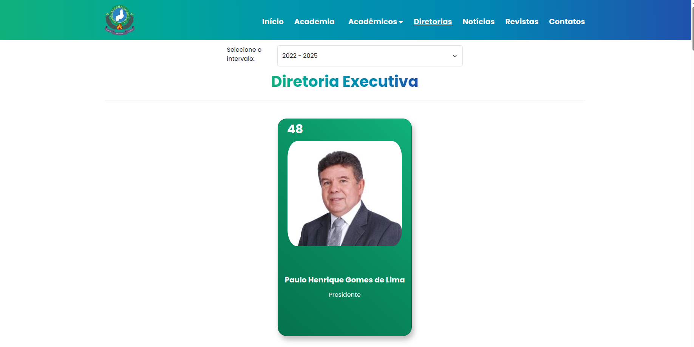
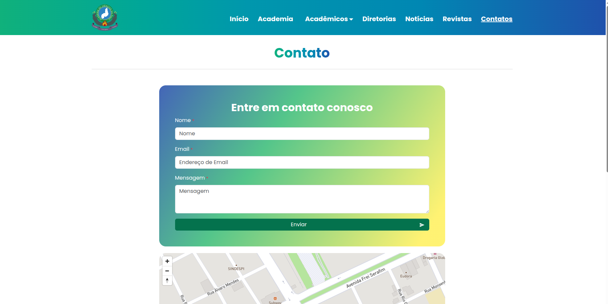

##### Project Overview

During my work on building a website dedicated to sharing academic content from the Science Academy of Piauí (ACIPI), I was responsible for a wide range of tasks in both the backend and the frontend throughout its development. I had the chance to work with a team of people from different areas to ensure efficiency and quality in every stage of the project.

**Summary**: Website dedicated to sharing academic content and institutional information from the Academia de Ciências do Piauí (Science Academy of Piauí).

This project was developed as part of my work at LABIRAS - Laboratory of Intelligent Robotics, Automation and Systems, associated with the Federal Institute of Education, Science and Technology of Piauí (IFPI).

##### Project Images

###### About Page

###### History Page

###### News Page

###### Board of Directors - Elected Members Page

###### Contact Page

##### Technology Stack

**Frontend:**
- React.js with JavaScript
- React Bootstrap for styling and responsive design

**Backend:**
- Express.js for API development
- RESTful API architecture

**Database & ORM:**
- PostgreSQL for data storage
- Prisma.js for database management and queries

**Infrastructure:**
- Docker containers for environment standardization
- Amazon S3 for file storage (if applicable)

**Language:**
- JavaScript (full-stack)

##### Key Features

- **Academic Content Sharing**: Platform for sharing scientific and academic content
- **Institutional Information**: Display of academy information, history, and news
- **Board Management**: Information about elected board members and directors
- **Contact System**: Contact page for communication
- **Responsive Design**: Modern interfaces that adapt to different devices
- **Dynamic Content**: Interactive and responsive user experiences

##### Development Process

Throughout the development process, we used Docker containers. This choice was essential for improving team collaboration and standardizing the work environment. It also made the deployment process easier.

The frontend was built with React.js and React Bootstrap, which are well known for creating dynamic and responsive experiences. These tools were perfect for developing intuitive and modern interfaces that adapt to different devices.

On the backend, Express.js allowed us to maintain fast and secure data flow between the frontend and the database. To manage the data with efficiency and scalability, we used Prisma.js together with PostgreSQL, which provided a solid and reliable structure for storage and queries.

##### My Contributions

During this project, I was responsible for:
- **Full-stack Development**: Worked on both frontend and backend throughout the development
- **Frontend Development**: Built React.js components with React Bootstrap for styling
- **Backend Development**: Developed Express.js API endpoints and server logic
- **Database Management**: Implemented database schemas and queries using Prisma.js
- **Docker Configuration**: Set up containerization for team collaboration
- **Team Collaboration**: Worked with multidisciplinary team to ensure quality

##### Credits

This project was developed by:

- **Diego de Sousa Araújo** - Developer - [LinkedIn](https://www.linkedin.com/in/daliego/)
- **Halysson Pimentel** - Developer - [LinkedIn](https://www.linkedin.com/in/halysonitallo/)
- **Paulo Roberto** - Developer - [LinkedIn](https://www.linkedin.com/in/paulo-ra-leal/)
- **Kauê Cavalcante** - Manager - [LinkedIn](https://www.linkedin.com/in/kaue-cavalcante/?originalSubdomain=br)

**Orientador:**
- **Francisco Marcelino** - Advisor - [IFPI Portfolio](https://integra.ifpi.edu.br/portfolio/pessoas/francisco-marcelino-almeida-de-araujo)

##### Skills & Competencies

- Docker
- System Deployment
- Amazon S3
- Express.js
- Reactive Programming
- JavaScript
- PostgreSQL
- Prisma
- React.js
- SQL

##### Project Links

- **Built News Portal**: [Academia de Ciências do Piauí (ACIPI)](https://www.acipiaui.org.br/)
- **Institution**: Associated with Federal Institute of Education, Science and Technology of Piauí ([IFPI](https://www.ifpi.edu.br/))

##### Project Context

This project was developed as part of my work at LABIRAS (Laboratory of Intelligent Robotics, Automation and Systems), associated with IFPI. The website serves as a platform for the Science Academy of Piauí to share academic content, institutional information, and engage with the scientific community.

