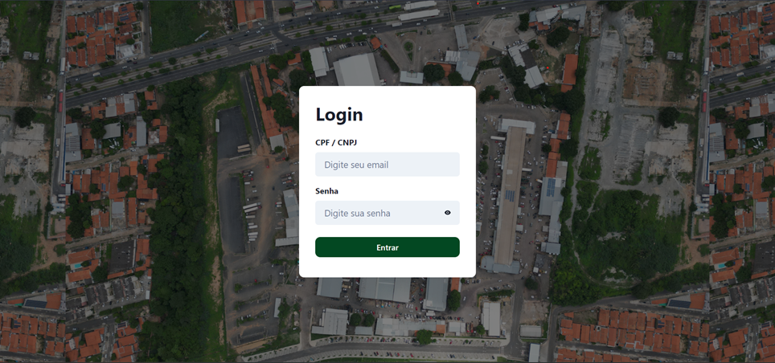
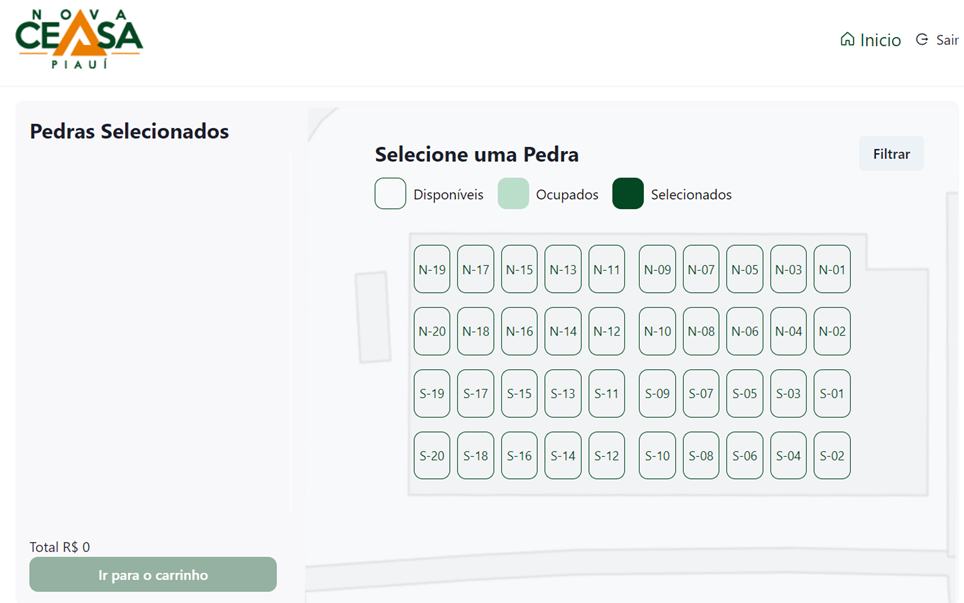
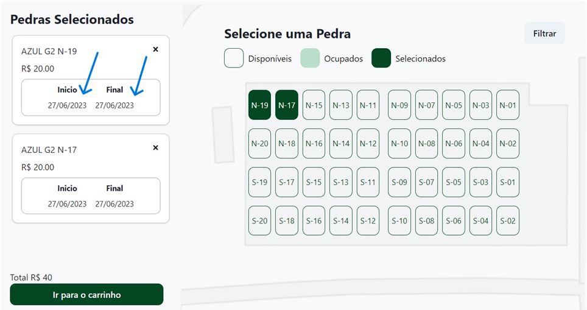
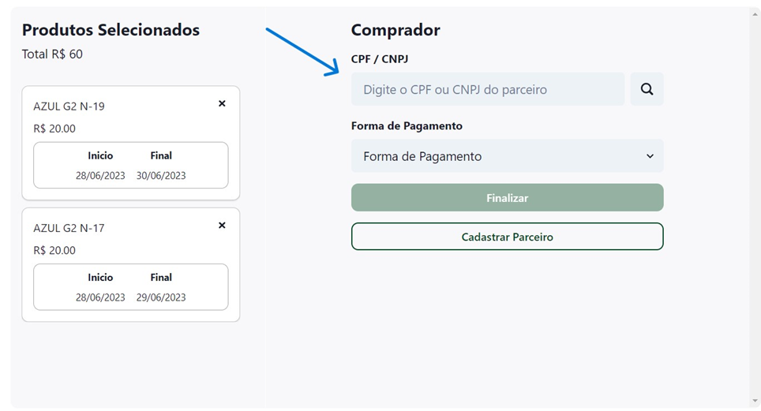
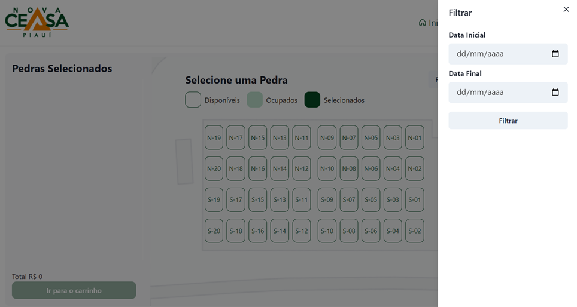
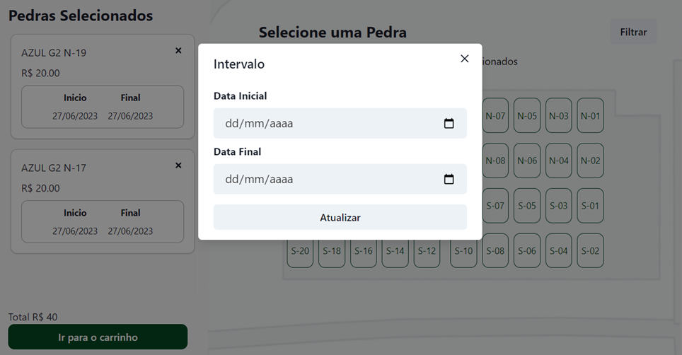
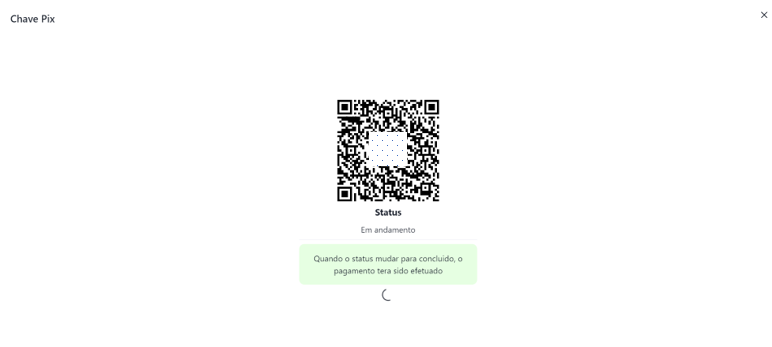

##### Project Overview

The Ceasa+ project was developed through a partnership between Nova Ceasa Piauí and the Federal Institute of Education, Science and Technology of Piauí (IFPI). The goal was to make it easier to rent the Nova Ceasa sales spots, known as "pedras", which were previously rented only through notes written by the analysts, the professionals responsible for handling the rentals.

**Summary**: System for renting sales spots ("pedras") at Nova Ceasa, automating a process that was previously manual (analyst notes), reducing errors and increasing financial security.

##### Company Information

- **Company**: [Nova Ceasa Piauí](https://novaceasa.com.br/)
- **Partnership**: Federal Institute of Education, Science and Technology of Piauí (IFPI)
- **Project Type**: Full Stack TypeScript Application

##### Project Images

###### Login Page

###### Main Dashboard - Home Screen

###### Shopping Cart with Selected Pedras

###### Cart View

###### Filter Popup

###### Filter Applied in Cart

###### Registration Page

###### Generated QR Code

##### Technology Stack

**Frontend:**
- React.js with TypeScript
- Chakra UI (for optimized styling and component library)

**Backend:**
- Express.js with TypeScript
- RESTful API architecture

**Database:**
- MySQL

**Integrations:**
- Payment services API
- ERP Sankhya (Nova Ceasa's enterprise resource planning system)

##### User Flow

The user flow begins on the initial page, where the customer tells the analyst the time range they want to rent. If no time range is given, the system filters by default for a same day rental.

After the filter is applied, all available pedras appear with one of the following states:
- **Red**: The pedra is not available for the selected time period
- **Transparent with green borders**: The pedra is available for rental
- **Solid green**: The pedra has been selected for rental

After choosing the pedras, the customer provides their CPF to the analyst. If the customer is already registered, they can proceed to the payment page. If not, they must be registered before continuing.

The customer can then pay either by Pix (instant payment) or in cash. After payment, the rental is automatically recorded and integrated with the financial system and ERP.

##### Key Features

- **Automated Rental Process**: Eliminates manual note-taking by analysts
- **Real-time Availability**: Visual status indicators for sales spots
- **Customer Management**: Registration and CPF/CNPJ validation
- **Payment Integration**: Support for Pix and cash payments
- **ERP Integration**: Automatic synchronization with Sankhya ERP
- **Financial Security**: Reduced risk of errors and money diversion
- **QR Code Generation**: For payment and tracking purposes

##### Impact & Benefits

The application became a key factor in improving the company workflow and financial security. With the system in place, several intermediate steps were automated, from the moment the rental is recorded to the moment the amount is processed in the financial system.

**Key Improvements:**
- **Automated Intermediate Steps**: Streamlined process from rental recording to financial processing
- **Reduced Analyst Errors**: Eliminated manual note-taking and data entry mistakes
- **Increased Traceability**: Complete audit trail of all transactions
- **Enhanced Security**: Lowered risk of possible money diversion
- **Improved Efficiency**: Faster rental processing and reduced administrative overhead

##### Project Authors

This project was developed by:

- **Diego de Sousa Araújo** - [LinkedIn](https://www.linkedin.com/in/daliego/)
- **Romero Medonça** - [LinkedIn](https://www.linkedin.com/in/rm3d0nc4/)
- **Werton Silva** - [LinkedIn](https://www.linkedin.com/in/werton-silva-dev/)

##### Project Status

**Note**: The source code is confidential and not publicly available. This project was developed as part of a partnership between Nova Ceasa Piauí and IFPI.

