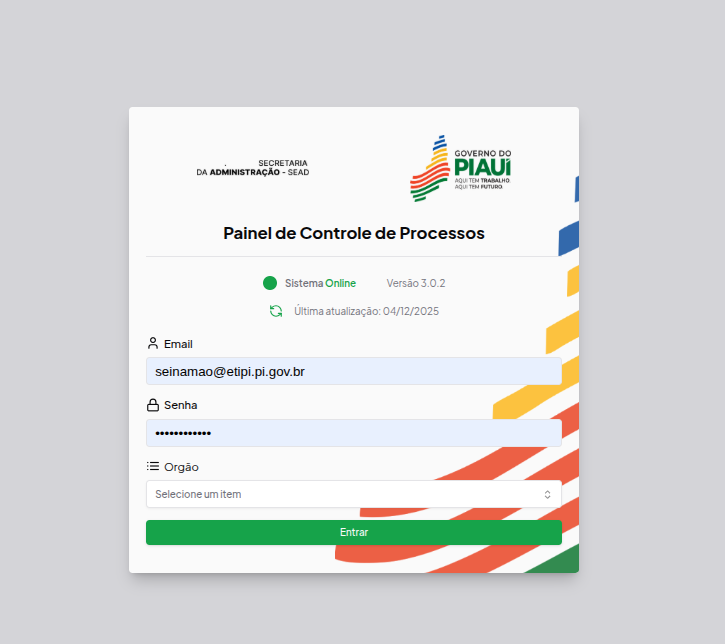

##### Project Overview

**Summary**: Web platform for managing administrative processes in the State Secretariat of Administration (SEAD) of Piauí, featuring gov.br login integration, custom indicators, informational panels, and document viewing in PDF, HTML, or image formats.

The SEAD Panel is a web platform used to manage administrative processes for the State Secretariat of Administration (SEAD) of Piauí. The platform includes login through gov.br, custom indicators, informational panels, and document viewing in PDF, HTML, or image formats.

The project was originally created by my senior [Monuery Junior](https://www.linkedin.com/in/monnueryj/?originalSubdomain=br). I worked on the system by building new features and keeping the platform updated.

##### Project Images

###### SEAD Logo

###### Platform Screenshot

##### Technology Stack

**Frontend:**
- React.js with TypeScript
- Tailwind CSS for styling
- Shadcn UI for component library

**State Management & Data:**
- Zustand for state management
- TanStack Query (React Query) for data fetching
- Axios for HTTP requests

**Forms & Validation:**
- React Hook Form for form management
- Zod for schema validation

##### Key Features

- **Authentication**: Integration with gov.br login system
- **Custom Indicators**: Configurable dashboards and metrics
- **Informational Panels**: Real-time data visualization
- **Document Management**: View documents in multiple formats (PDF, HTML, images)
- **Administrative Process Management**: Complete workflow for handling administrative procedures

##### My Contributions

- **Frontend Development**: Worked on frontend features and integration with the govBr
- **Feature Development**: Built new features to enhance platform functionality
- **Code Maintenance**: Maintained and updated existing codebase
- **System Integration**: Ensured compatibility with gov.br authentication system
- **User Experience**: Improved user experience and interface responsiveness
- **Bug Fixes**: Resolved issues and performed performance optimizations

##### Project Links

- **Live Application**: [https://painel.sead.pi.gov.br/login](https://painel.sead.pi.gov.br/login)

##### Project Team

- **Original Developer**: [Monuery Junior](https://www.linkedin.com/in/monnueryj/?originalSubdomain=br) - Senior developer who created the project
- **My Role**: Feature development and maintenance
