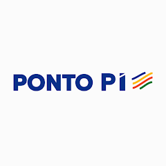
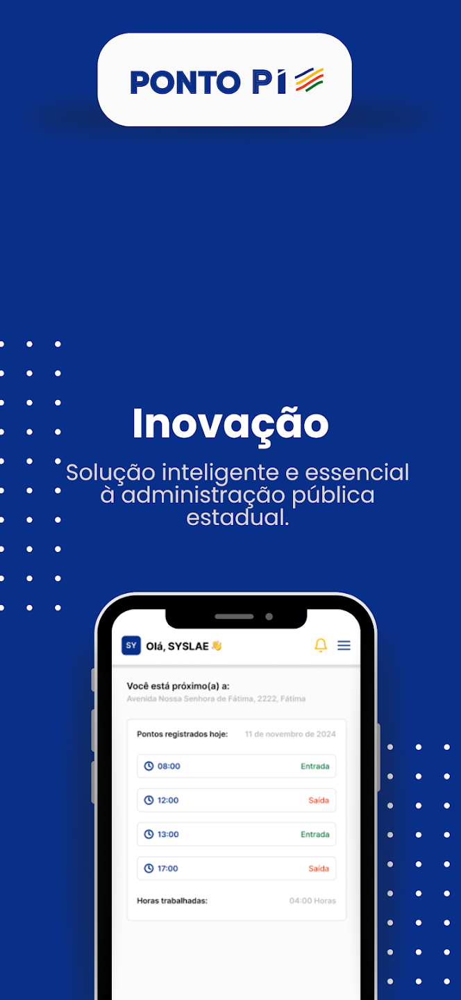

##### Project Overview

Ponto PI is a React Native app with development managed by my senior [Monuery Junior](https://www.linkedin.com/in/monnueryj/?originalSubdomain=br). The app's goal is to record and manage employee work hours with accuracy and compliance.

Ponto PI is a tool used to record, control, and manage employee work hours in an organization. It can be implemented in different ways, including manual, mechanical, digital, or biometric systems, depending on the company's needs. The main function of this system is to ensure accuracy and compliance with labor laws, in addition to optimizing human resources management.

I joined the project to maintain the codebase and develop new modules. The app was built with React Native and related tools, focusing on reliability, clear workflows, and an efficient experience for organizations.

##### Project Images

###### Ponto PI Logo

###### Initial Screen

###### Points Page

##### Technology Stack

- **Framework**: React Native
- **Platform**: iOS and Android
- **Features**: Time tracking, biometric integration support, compliance management

##### Key Features

- **Work Hours Recording**: Accurate recording of employee work hours
- **Compliance Management**: Ensure compliance with Brazilian labor laws
- **Multiple Implementation Methods**: Support for manual, digital, and biometric systems
- **Human Resources Optimization**: Streamline HR management processes
- **Reliable Workflows**: Clear and efficient processes for organizations
- **Data Accuracy**: Precise tracking and reporting of work hours
- **User-friendly Interface**: Intuitive experience for employees and administrators

##### Project Links

- **Google Play Store**: [https://play.google.com/store/apps/details?id=com.bigdata.pontopi&hl=pt_BR](https://play.google.com/store/apps/details?id=com.bigdata.pontopi&hl=pt_BR)

##### My Contributions

During my time working on this project, I focused on:
- Maintaining the existing codebase
- Developing new modules and features
- Ensuring code reliability and performance
- Improving user workflows and experience
- Bug fixes and issue resolution
- Code refactoring and optimization

