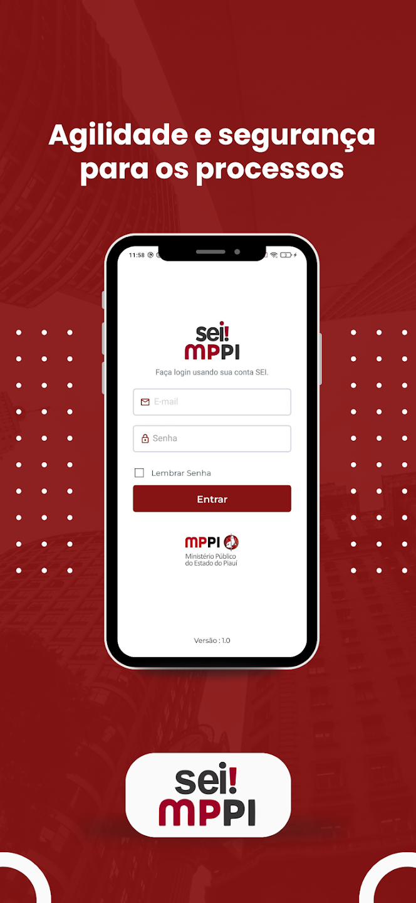

##### Project Overview

**Summary**: Mobile version of the official electronic document and process management system used by the Public Ministry of Piauí, providing access to documents and processes on mobile devices.

I worked on the React Native app SEI MPPI, a mobile version of the official electronic document and process management system used by the Public Ministry of Piauí (MPPI).

SEI! MPPI - Sistema Eletrônico de Informações - Ministério Público do Piauí

The Electronic Information System is a system developed by the Brazilian government for managing electronic processes and documents. It was created by the Federal Regional Court of the 4th Region and is used by various federal, state, and municipal government agencies and entities in Brazil.

SEI! MPPI is a platform that allows the electronic processing of documents, processes, and information, replacing paper processes with digital processes. It offers resources for creating, editing, signing, processing, consulting, and archiving documents electronically. Additionally, the system offers mechanisms for deadline control, workflow, and information security.

I was not part of the original development team, but I helped maintain the project, fix issues, and add new features that improved the user experience and kept the app aligned with the main platform.

##### Project Images

###### SEI MPPI Logo

###### Login Page

###### Navigation Bar Page

##### Technology Stack

**Mobile Framework:**
- React Native
- JavaScript/TypeScript

**Platform:**
- iOS and Android

**Integration:**
- Connected to SEI web platform API

##### Key Features

- **Document Management**: Access and manage electronic documents
- **Process Tracking**: Monitor and track administrative processes
- **Electronic Signatures**: Sign documents digitally
- **Deadline Control**: Manage and track important deadlines
- **Workflow Management**: Navigate through process workflows
- **Secure Access**: Secure authentication and data protection
- **Offline Capabilities**: Access to cached documents and processes

##### My Contributions

- **Code Maintenance**: Maintained the existing codebase
- **Bug Fixes**: Fixed bugs and resolved issues
- **Feature Development**: Added new features to improve user experience
- **Platform Alignment**: Ensured app alignment with the main SEI platform
- **Performance**: Performed performance optimizations
- **Code Quality**: Code refactoring and improvements

##### Project Links

- **Google Play Store**: [https://play.google.com/store/apps/details?id=br.gov.pi.seimppi&hl=pt_BR](https://play.google.com/store/apps/details?id=br.gov.pi.seimppi&hl=pt_BR)
